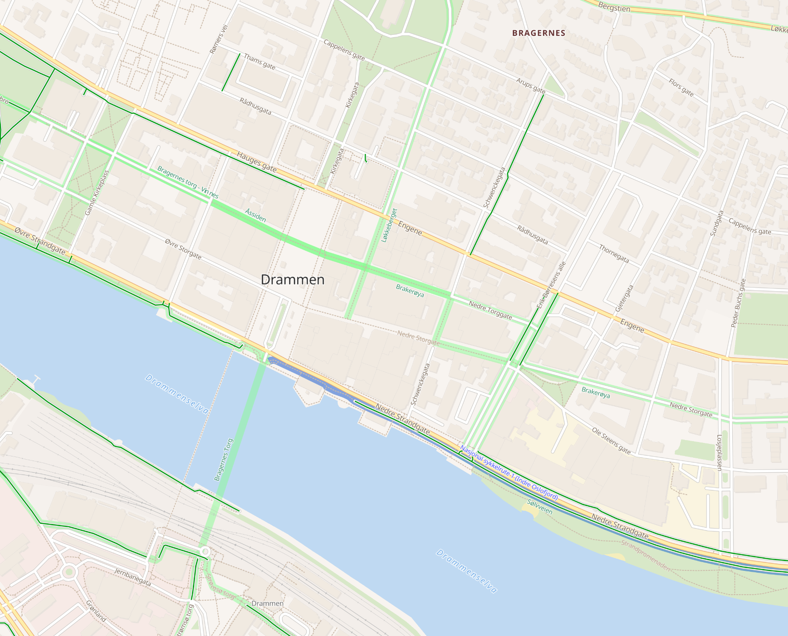

# OSM Cyclo Bright
A Mapbox GL basemap style showcasing OpenStreetMap data for cyclists.
It is using the vector tile schema of [OpenMapTiles](https://github.com/openmaptiles/openmaptiles).

## Preview



## Edit the Style

Use the [Maputnik CLI](http://openmaptiles.org/docs/style/maputnik/) to edit and develop the style.
After you've started Maputnik open the editor on `localhost:8000`.

```
maputnik --watch --file style.json
```
## Generating the map

This repo contains a `style.json` for rendering a finished vector tiles.

On top of that it also contains config and scripts to generate vector
tiles using [tilemaker](https://github.com/systemed/tilemaker).

These are found in the `tilemaker` folder.

There is a convenience Makefile for local development. 

In order to spin up a developement server, run:

```
make tilemaker
```
